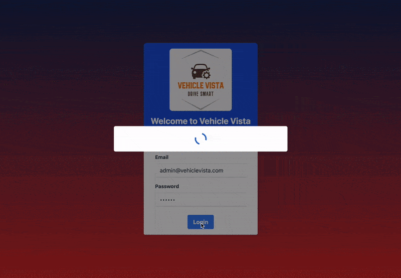

# Vehicle Vista

## Overview

A web app to enable a repair garage to manage the customer vehicles they currently hold.

## Demo

## Functionality

This app provides a user interface to add vehicles, list vehicles, mark vehicles as repaired and delete vehicles. Vehicles have the properties ‘Make’, ‘Model’, ‘Registration Number’ and ‘Notes’, all of which are required except for ‘Notes’.

## Instructions

Vehicle Vista can be used on Netlify or locally:

### Deployment

This app is [hosted on Netlify](https://vehicle-vista.netlify.app/).

From there, you will be shown the landing page, where you can:

- Click on 'Login' to get started
- Create, read, update and delete vehicles
- Reset to default data

### Run Locally

Clone this repository, open it in your IDE such as VS Code, and run these commands in the integrated terminal:

- `cd garage-app/` to go to the project directory.
- `npm install` to install dependencies.
- `npm run server` to start the dev server.
- Open another terminal (in same directory) and `npm run dev`
- You should now be able to access the app on `http://localhost:5173/`

## Tech Stack

**Client:** React, Vite, Recoil, TailwindCSS, Sweet Alerts

- React and Vite for building a fast frontend.
- Recoil is a global state management library for small to medium sized projects and prototypes.
- The deployed version uses localStorage to keep state between runs.

**Server:** Node, JSON Server

- Node to run and debug JavaScript code locally.
- JSON Server is used locally - this provides a mock REST API to test CRUD operations. The user can see real time updates in the db.json file.
